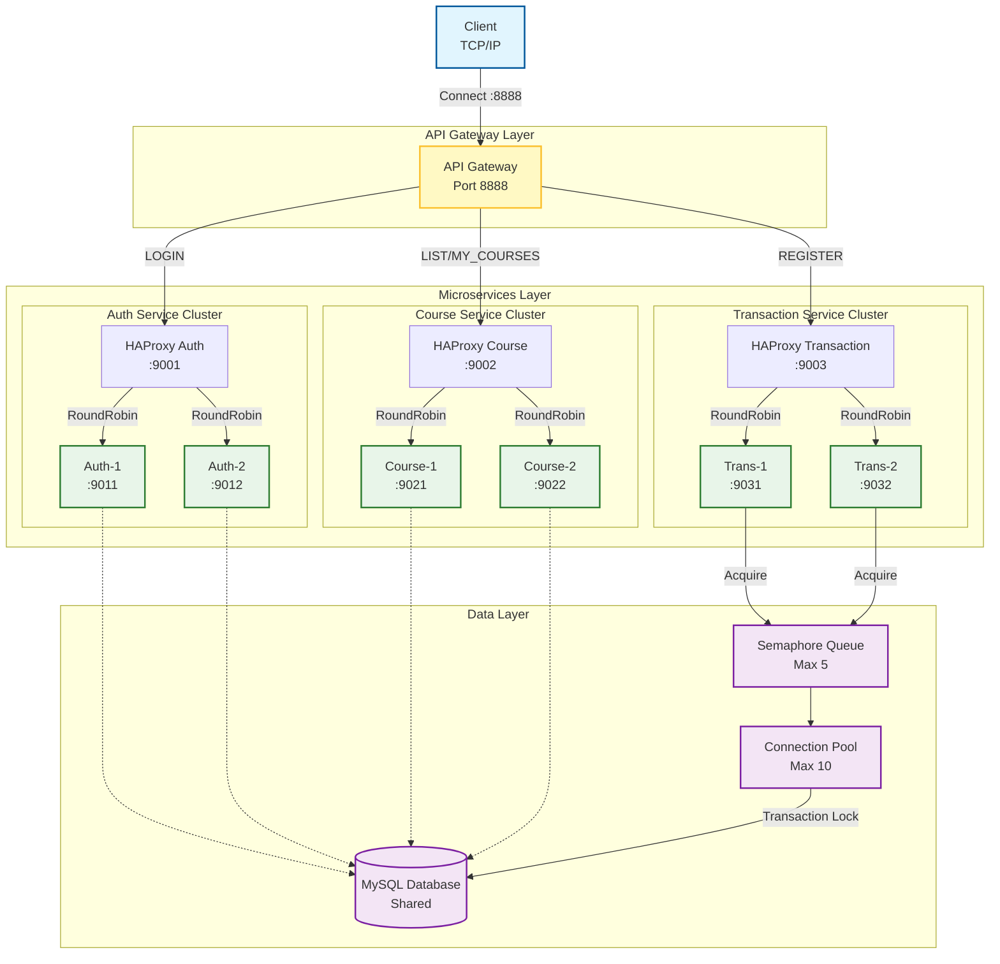

# Sơ đồ Kiến trúc Hệ thống - Distributed Course Registration System

## 📋 Tổng Quan

Hệ thống đăng ký học phần phân tán được xây dựng theo kiến trúc **Microservices** với **API Gateway**, **Load Balancing**, và **Distributed Processing**. Hệ thống cho phép sinh viên đăng ký học phần, xem thời khóa biểu trong môi trường phân tán, đảm bảo tính toàn vẹn dữ liệu.

## 🏗️ Sơ Đồ Kiến Trúc



## 🌐 Tại Sao Đây Là Hệ Thống Phân Tán?

Khi chạy trên một máy tính demo, hệ thống vẫn đảm bảo các tính chất của một hệ phân tán thực thụ:

### 1. Phân tán về Xử lý (Distributed Processing)
*   Thay vì một "bộ não" (Mono-process) làm tất cả, hệ thống chia thành **nhiều tiến trình Server (Server Processes)** riêng biệt.
*   Mỗi container Docker chạy một tiến trình có **PID (Process ID)** riêng. Hệ điều hành sẽ tự động điều phối các PID này chạy trên các nhân CPU (Cores) khác nhau.
*   **Kết luận**: Công việc xử lý được chia nhỏ và thực hiện song song (Parallel execution) trên phần cứng đa nhân.

### 2. Phân tán về Bộ nhớ (Memory Isolation)
*   **Không gian địa chỉ riêng biệt**: Mỗi Service chạy trong một container với RAM được cách ly hoàn toàn.
*   **Fault Tolerance (Chịu lỗi)**: Nếu `Transaction Service 1` bị lỗi tràn bộ nhớ (Memory Leak) và crash, `Transaction Service 2` và các service khác **không bị ảnh hưởng**.
*   **Khác biệt với Monolithic**: Trong Monolithic, một module bị lỗi bộ nhớ có thể kéo sập toàn bộ hệ thống.

### 3. Tính Trong suốt vị trí (Location Transparency)
*   Hệ thống thiết kế để **không phụ thuộc vị trí vật lý**. 
*   Các service giao tiếp qua mạng (TCP/IP socket), không gọi hàm nội bộ (Function Request).
*   **Triển khai thực tế**: Chỉ cần copy container sang máy khác và cập nhật IP cấu hình, code không cần sửa đổi bất kỳ dòng nào.

---

## 🔄 Luồng Xử Lý Request

### 1. **Đăng Nhập (LOGIN)**
```
Client → API Gateway → HAProxy Auth → Auth Service (1 hoặc 2) 
                                          ↓
                                    MySQL (users table)
                                          ↓
                               ← Response ← ← ←
```

### 2. **Xem Danh Sách Môn Học (LIST)**
```
Client → API Gateway → HAProxy Course → Course Service (1 hoặc 2)
                                            ↓
                                  MySQL (sections, subjects, teachers)
                                            ↓
                                 ← JSON Response ← ← ←
```

### 3. **Đăng Ký Môn Học (REGISTER)** - *Luồng quan trọng nhất*
```
Client → API Gateway → HAProxy Transaction → Transaction Service (1 hoặc 2)
                                                      ↓
                                              [Semaphore Queue]
                                        (Tối đa 5 request cùng lúc)
                                                      ↓
                                            Connection Pool (10)
                                                      ↓
                                          BEGIN TRANSACTION
                                                      ↓
                                    SELECT ... FOR UPDATE (Lock)
                                                      ↓
                                          UPDATE + INSERT
                                                      ↓
                                               COMMIT
                                                      ↓
                                        ← Response ← ← ← ←
```

---

## ⚙️ Cơ Chế Bảo Vệ & Đồng Bộ Dữ Liệu

Hệ thống sử dụng mô hình **"Đầu to, đuôi nhỏ"** (Distributed Compute, Centralized Storage) để đảm bảo an toàn.

### Vấn đề Race Condition (Tranh chấp dữ liệu)
Khi có nhiều Server cùng xử lý đăng ký cho một lớp học (ví dụ: lớp chỉ còn 1 chỗ trống), nếu không có cơ chế bảo vệ, nhiều sinh viên có thể đăng ký thành công vượt quá sĩ số.

### Giải pháp: 3 Tầng Bảo Vệ

#### Tầng 1: Semaphore (Tại Application Layer)
*   **Vị trí**: `transaction_service.py`
*   **Cơ chế**: `threading.Semaphore(5)`
*   **Tác dụng**: Giới hạn chỉ **5 request đăng ký** được xử lý đồng thời trên mỗi instance. Các request thứ 6 trở đi phải xếp hàng chờ. Giúp giảm tải đột ngột (Back-pressure).

#### Tầng 2: Connection Pool (Tại Database Access Layer)
*   **Vị trí**: `database_manager.py`
*   **Cơ chế**: `MySQLConnectionPool(pool_size=10)`
*   **Tác dụng**: Singleton Pattern đảm bảo toàn bộ ứng dụng chỉ mở tối đa 10 kết nối xuống Database. Ngăn chặn việc làm sập Database do quá nhiều kết nối (Connection Exhaustion).

#### Tầng 3: Transaction Locking (Tại Data Layer - *Quan trọng nhất*)
*   **Vị trí**: SQL Query
*   **Cơ chế**: `SELECT ... FOR UPDATE`
*   **Tác dụng**: Đây là "chìa khóa kho".
    1.  Khi một Transaction đọc số lượng chỗ trống, nó **KHÓA (LOCK)** dòng dữ liệu đó lại.
    2.  Các Transaction khác muốn đọc phải **đợi** cho đến khi Transaction đầu tiên hoàn tất (Commit/Rollback).
    3.  Đảm bảo tính **Nhất quán (Consistency)** tuyệt đối: Không bao giờ có chuyện 2 người cùng thấy 1 chỗ trống cuối cùng.

---

## 🧩 Các Thành Phần Chính

### 1. **API Gateway** (`server/api_gateway.py`)
- **Port 8888**
- Điểm vào duy nhất, giấu kín cấu trúc hệ thống bên trong.
- Quản lý phiên đăng nhập (Session Management).

### 2. **Microservices**
- **Auth Service** (Port 9011, 9012): Xác thực người dùng.
- **Course Service** (Port 9021, 9022): Tra cứu thông tin (Read-only operations).
- **Transaction Service** (Port 9031, 9032): Xử lý nghiệp vụ quan trọng (Write-heavy operations).

### 3. **HAProxy Load Balancers**
- Cân bằng tải theo thuật toán **Round Robin**.
- Tự động Health Check: Nếu một service chết, HAProxy tự động ngừng gửi request đến đó.

### 4. **MySQL Database**
- Nơi lưu trữ duy nhất (Single Source of Truth).
- Đảm bảo ACID (Atomicity, Consistency, Isolation, Durability).

---

## 🐳 Docker Deployment

Toàn bộ hệ thống được đóng gói và vận hành qua `docker-compose`.

| Service | Internal Port | External Port | Chức năng |
|---------|---------------|---------------|-----------|
| `api_gateway` | 8888 | 8888 | Cổng giao tiếp với Client |
| `haproxy_*` | 9001-9003 | 9001-9003 | Load Balancers |
| `auth_*` | 9001 | 9011-9012 | Logic Đăng nhập |
| `course_*` | 9002 | 9021-9022 | Logic Xem môn học |
| `trans_*` | 9003 | 9031-9032 | Logic Đăng ký |
| `mysql` | 3306 | 3306 | Cơ sở dữ liệu |

### Các Lệnh Quản Lý:
- **Khởi động**: `docker-compose up -d`
- **Tắt**: `docker-compose down`
- **Xem Status**: `docker-compose ps`
- **Xem Logs**: `docker-compose logs -f transaction_service_1`

## 📊 So Sánh Kiến Trúc

| Tiêu chí | Monolithic (Cũ) | Microservices (Mới) |
|----------|-----------------|---------------------|
| **Khả năng chiu lỗi** | Thấp (1 lỗi lầm sập tất cả) | Cao (Lỗi cô lập trong 1 service) |
| **Mở rộng (Scaling)** | Khó (Phải nhân bản cả cục to) | Dễ (Chỉ nhân bản service cần thiết) |
| **Công nghệ** | Dính chặt 1 ngôn ngữ | Đa ngôn ngữ (Polyglot) |
| **Triển khai** | Lâu, rủi ro cao | Nhanh, linh hoạt (Docker) |

## 📝 Ghi Chú cho Bảo Vệ Đồ Án
- Hệ thống này **mô phỏng** môi trường production thực tế.
- Việc chạy trên 1 máy chỉ là giới hạn phần cứng, **kiến trúc phần mềm** đã hoàn toàn đạt chuẩn phân tán.
- Cơ chế Locking đảm bảo an toàn tuyệt đối cho dữ liệu đăng ký.
